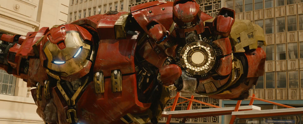

Here we go again!  

Another trailer, in under 2 weeks I have been swept off my feet by Marvel! 
Two trailers! First Ant Man and now Age of Ultron, and with the Super Bowl around the corner 
I hope to see more (probably a small teaser for one of the movies next year).

**SPOILERS AHEAD, STAY BACK IF YOU DON’T WANT ANYTHING SPOILED**

But that is not why we are here!
A few notes before we begin (I made a nice bullet list, Heehee)

- Still no vision

- A good look of Ultron (In various versions)

- New Ironman suit (happy face)

- HULK BUSTER (F*** YEAH)

- Hulk bewitched?

- Who is Andy Serkis?

Arhh yes, a few points to pick up. Some of them are just notes and will not be touched upon in this 
post, while some will be! So let’s begin!

If anything written in this post doesn’t make sense, please ask questions, I’m happy to explain!

In the start of the trailer, we see Hawkeye escorting civilians into an 
aircraft (looks like S.H.I.E.L.D tech to me). Something has clearly attacked this city. 
Meanwhile, we hear Tony Stark proclaim “This vulnerable world? Needs something more powerful than us”. 
I believe this is a precursor towards having a reason to craft 
Ultron from his father’s drawings(look at my Ant Man posts if this confuses you).

After the speech from Tony, we are introduced to Captain America as well as Hawkeye in his new suit.

We then hear a voice (which is Ultron, I’m sure) say, “everyone creates the thing they dread”, 
while we see Tony walk into what looks like a workshop and a quick cut to a destroyed 
Ultron (Old Iron Man suit), glowing up while it possibly rebooting. We then cut to the clip we have 
seen a million times; Ultron walking into the party to the beat of the music in the background. 
Bruce Banner looks to someone (Tony Stark is my guess).

“Ultron?” he asks. Tony looks confused. Ultron then replies, 
“In the flesh.” (I think it is Ultron’s voice, since it doesn’t sound like Bruce Banner).

The trailer then cuts to an explosion, which then again quickly cuts to a short shot of the Twins, 
Quicksilver and Scarlet Witch, followed by a shot of Bruce Banner fumbling around in a lab follows. 
We get a quick shot of his eyes; They are green and he looks angry (be careful of the Hulk!).

 

While we are watching the beautiful eyes of Bruce Banner, Nick Fury starts to talk. 
While he is talking, we cut to a scene of him and a woman by some water. 
Nick Fury says, “No matter who wins or loses, trouble always comes around”.

Phew!
That was a tough one! So far we have gone through only 40% of the trailer and we…haven’t even touched 
the surface of all the cool stuff going on!

**So let’s just continue.**

The lady at the water! Who is she? What is her purpose? To start off, I want to admit I have no idea 
who she is. However! I do have two theories as to who she could be. 
These are just speculations, so don’t go too hard on it as facts!

**Dora Milaje theory:**
What is a Dora Milaje? Dora Milajes are Royal Bodyguards recruited from each tribe of Wakanda. 
They protect T'Challa (Black Panther) with their lives. They are not only bodyguards, 
but also what people call, “The Perfect Women of Wakanda”, and they are suited to become the next 
queen of Wakanda. By the look of the character I think this is the true theory; 
looks African and has golden tattoos, which is what Wakandian women are known for.

 

**Ragnarok (Hel) theory:**
Up next is a more abstract theory in my world, (again it’s a theory, so take it lightly!).
Ragnarok! In Norse mythology, Ragnarok is the end of everything and the rebirth of a new world. 
Hel is a Norse goddess who presides over the realm by the same name, Hel. Hel is the Norse version of Hell.
Hel receives a portion of the dead people in the world. Hela, however, is the Marvel version of the same 
character, and she is presumed to be visible at Ragnarok at Thor’s death.

 

After the scene with the unknown women, we see a new clip of Tony standing over Ultron. 
We hear Thor speak and we pan to Thor. Thor cries “You’re meddling with things you don’t understand”. 

This line of dialogue could refer to the scepter from the first Avengers movie, the Tesseract which, 
if you don’t know, is an Infinity Stone from Guardians of the Galaxy), or just the Infinity Stones in 
general. After the dialogue, we quickly cut to Scarlet Witch shooting a “bolt” of her magic.

This is cut together with a clip of Iron Man being smashed into a metal door. 
Note this is NOT Scarlet Witch’s doing. It’s probably Ultron doing a laser show.

The next thing we see is a headshot of Natasha Rumanoff (Black Widow) reflecting “We have no place in this world”, followed by what looks like some kind of surgery. This is the surgery I believe took place while she was in KGB. I have said in my other post about Age of Ultron that Scarlet Witch puts the Avengers under a “spell”. Perhaps that will show them visions about their past and or future. This could be Rumanoff’s vision, her being reminded about her past.

The next shot we see is Ultron flying around, some explosions, a flying van and BOOM, 
new Iron Man suit action (yay!). 
Quickly, we go to a few officers hiding behind a car, which is then swiftly kicked by the Hulk! 
We then cut to a few scenes with Rumanoff. The first is a “butt shot” as I like to call it, 
from the waist below, and then a headshot of her turning her head to us and looking at something. 

After the 2 shots with Rumanoff we got to one of my favourite scenes in this trailer! We see Andy Serkis! 
Without any CGI, wuuuh! There is a HUGE hint towards what character he is playing! 
But first, a few quick facts about Andy Serkis in the Marvel Universe. 
We know he is playing a villain, and it has been strongly rumoured who he will be. 
But now the rumours - or proof, if you will - is overwhelming! Around his neck is a Claw. Yes! A claw! 

That sounds really lame, right? But I think we should see this on a really, really low “baby level”. 
What Marvel villain goes hand in hand with the word “claw”? That is, of course, Ulysses Klaw! 
Read my blog about Age of Ultron to get some back story about Klaw.

We then cut to a few action scenes with a fighter jet and Captain America fighting a version of Ultron. 
After that clip, we see Hulk, Rumanoff, and what people think is a “love scene”: We see them touch hands. 
his is quickly interrupted, however, by Ultron saying one of my favourite lines of all the Marvel movies:

**“I will tear you apart… from the inside”.**

While Ultron utters this, we see a clip of him using his Red Sith powers and shooting a laser 
(it’s not really Sith powers but it sounds cool!). We also see Thor, either getting hit by thunder, 
or trying to control thunder without Mjolnir. 

Despite what people in the Marvel Universe believe, Mjolnir is not the object making Thor able to 
control elements. He is able to control elements himself and thunder is one of the elements he can control.
Mjolnir just makes the task “easier”. 

We then see an unknown woman turn her head, which quickly cuts to Thor grabbing Tony Stark by his 
throat and pulling him up, and seemingly threatening him. Could it be because Tony created Ultron?

After that, we cut to a scene where we see a motorbike (Rumanoff is on the motorbike), 
and a car flying around while the Earth cracks and THEN; Hulkbuster! There are some badass introduction 
scenes of Hulkbuster and a scene where Hulk smashes the Hulkbuster with what looks like a piece of meta.
We then fade to black and the “scene” switches. We see the Avengers gathered, 
who appear to have been fighting(Ultron probably!). 

It cuts to Rumanoff who says, “Oh boy”, which I believe is a comment to 
Ultron coming back even after he should have been dead.

We then cut to another scene with Hulk. This time he charges towards the camera, before the scene cuts to 
the Hulkbuster clashing together with the Hulk and a long scene of them fighting. 
We end with a cut of Hulk looking towards the camera with red eyes! I believe he is being possesed by 
the Scarlet Witch, perhaps an entry lead for Doctor Strange to be brought into the 
MCU (Not that he will be brought in this movie but in a later movie, for example his own movie).

The trailer closes with the movie title and a quick look at Ultron.

