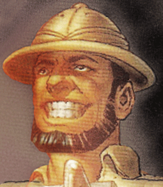

#####This will be the first post about Age of Ultron from Phase 2

[Age of Ultron Trailer](https://www.youtube.com/watch?v=tmeOjFno6Do)

###Age of Ultron

In the trailer, there are a few things I would like to point out and use these as arguments for what will happen and why it will happen through the rest of Phase 2 and 3.

The first thing we see in the trailer is a skyline. A quick cross check through google shows that it’s the skyline of Johannesburg (South Africa). I have a theory, especially after the reveal of Phase 3, that Kevin Feige is telling us that Black Panther has already been teased in the MCU (maybe in this trailer, i’m pretty sure. I will come back to this). So if you don’t know who Black Panther is, let me try to explain it briefly. If you know who Black Panther is, feel free to skip.

###Black Panther

The Black Panther, or T'Challa is the first biological son of T'Chaka, King of the African Nation of Wakanda. His mother, N'Yami, died during childbirth and his adopted older brother, Hunter, blamed him for her death. His second mother, Ramonda, left the family when T'Challa was only eight, and when he was in his teens, his father T'Chaka was murdered by Klaw (a mercenary) over the rare metal Vibranium, only found in African Country of Wakanda. He started training himself with one purpose in mind; take revenge. Klaw was later driven away after almost being killed by T’Challa, though Mr. Fantastic prevented him from doing so.

This is a picture of Ulysses Klaw(Andy Serkis in the movie)

###Back to Age of Ultron

In the story of the Black Panther, there are a few things we should focus on looking at in the Age of Ultron trailer. First, Vibranium! This super rare metal is used for Captain America’s shield, which is why it cannot break. The only thing that can break Vibranium is other sources of Vibranium. At the end of the Age of Ultron trailer, we see Captain America’s shield being broken
shield being broken. This supports my theory that Ultron will most likely douse himself in Vibranium to become more durable during his upgrades.

The other thing we should keep an eye on is Klaw. We see Klaw in his human form during the trailer(1.30). Here is a picture to compare. He is also quite easy to find in the trailer so just look around, he is there I promise.

Klaw is a mercenary / assassin ordered to kill the Black Panther (T’Chaka, the king), so he can get hold of Vibranium for his client. He hid under the floor of the castle in Wakanda and killed T’Chaka, but was injured by the young T’Challa and had to escape.

##The Twins

At the end of Captain America: The Winter Soldier we see “The Twins”, Wanda 
(Scarlet Witch) and Pietro (Quicksilver), or the Maximoff twins as they are called. 
Quicksilver is super fast, while Scarlet Witch is what many people will call a reality bender. 
In the comics she destroyed a building just by wanting it destroyed, and she started the Kree invasion just by wanting the Kree invasion to happen. 
The Kree is the alien race which Ronan is a part of. They love war and destruction. 

So in the trailer, we snippets as to what their powers do. 
We don’t see much of Quicksilver (his powers are more or less self explanatory), but we do get to see more of what Scarlet Witch is capable of. 
She is the more complex of the twins, in my opinion.

In the trailer we see some hints as to her “Reality bending” powers. 
We see Captain America back in time with Peggy, although it’s only for a split second before we are then shown Captain America’s shield, broken. 
If you have seen the leaked version of the Age of Ultron video, this was shown at the event as well. 
Tony Stark asks Steve Rogers, “What did she show you?”, implying that they all had a vision. 

They also talk about Thor leaving to figure out things.
My bet is that he won’t be there for a good chunk of the movie as he have left to Asgaard. 
Maybe Wanda showed him Loki taking over Asgaard? (Hint to Thor 2: The Dark World). 

Captain America doesn’t want to speak about his vision. 
Stark doesn’t like that, as he don’t trust people without a “dark side” as he calls it.

###Ant Man

Who is Ant Man and what role will he play in the MCU?
Many people don’t know much about this character and many people think they only made Ant Man as a filler character.
But in the “real world”, Ant Man should be super important character, especially if
they follow the comics, which i’m pretty sure they do!

In the comics, Ant Man is the main factor for creating Ultron. 
In the comics, Ant Man, or Hank Pym which is his real name as a scientist, has invented a particle 
called the “Pym Particle”. This particle is what makes him able to become larger or smaller. 
He also makes AIs to help humanity; one of these AIs, is Ultron.

Hank Pym creates Ultron as an experiment with High Intelligence robotics to help humanity and the Avengers. Ultimately, Ultron rebels against Pym, and hypnotizes and brainwashes him into forgetting that he ever existed. In the comics, he then organises the re-incarnation of “The Master of Evil” under the alias “Crimson Cowl”. Unfortunately, this story isn’t going to be a part of the MCU, so hopefully this will be a story for another time.

In the MCU we know that Ant Man: The movie will come after the Age of Ultron movie, and we
know that Ant Man will be the end of Phase 2. So the question is, what will happen in Ant Man?

My theory goes like this.

In Age of Ultron we know Tony Stark built Ultron (or an early version of him at least, as Ultron keeps upgrading and copying himself). 
I believe it will be through some old schematics of his father’s. 
In Ant Man, we will possibly see Stark’s father and Ant Man work together on some AI technology, 
which will explain why Tony has access to these old schematics from his father.