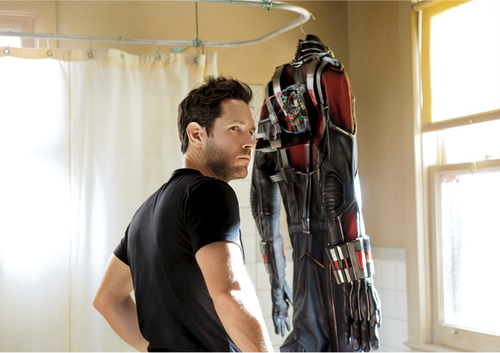

So, Ant Man!

I already wrote a blogpost more or less explaining the character but that 
doesn’t cover my main theory about how I think the movie will more or less pan out. So here we go!

**SPOILER ALERT - Read on your own risk to possibly have a movie ruined**

Ant Man is a special and weird character yet important as I noted in my other post. 
So to understand how he works and what he will do we need to learn pre-story about him. So I recommend you either read a wiki post about Hank Pym or read my other blog post.

Enough of the pre post stuff, let’s rock!

In the Ant Man trailer, we hear a character speak to Scott Lang, I assume it’s Hank Pym. 
So right off the bat, we have two characters who in the end will have been / become Ant Man. 

Hank asks Scott for help, as Hank is now becoming an old man. 
My believe so far is that, Hank Pym will be tangled in together with Agent Carter, 
which is also why they did show the Ant Man teaser trailer after the first episode of Agent Carter. 
Both to get it out, build hype but also to kind of tease where he belongs. 
Thats what I believe so far at least.

Hank needs Scott to become Ant Man to help him, Hank needs Scott to become the hero Scott’s daugther 
already think he is. To save the earth(I believe thats what he say in the trailer I quite can’t 
hear if it’s earth or theirs, I believe it’s earth)

So, lets talk about a bad guy? 
There is a few guesses(Rumours?) to who the bad guy is. A lot of things are pointing 
towards Yellowjacket, but if we have Yellowjacket as the bad guy it would mean that 
Hank Pym becomes a bad guy. That part would also fit the fact that Marvel usually have the bad guy 
voice the trailer, or some sort of bad guy voice the trailers.
YET! I don’t think Hank Pym will be our Yellowjacket, we have a character called Darren Cross 
who in the comics are only in like 2 issues, so he’s not a big character story wise, but he is pretty 
cool and many people think he is a sweet character and build nice even though he is so short in the story!

**Who is Darren Cross you ask? Darren Cross is the owner of a company called Cross Technological Enterprises.**

There is not much information about the company, but Darren made it all by himself, 
took it to the top and started competing with the high end competitors which was his dream. 
However, Darren have a terrible heart disease (How inconvenient), he uses his own technology to 
create a nucleorganic pacemaker to save his life. 
However this nucleorganic pacemaker mutated his body into some odd hulk look alike thing. 
He changes hearts several times through heart transplants. But all the hearts he swapped into got 
overused so fast due to the mutation of his body. He later kidnapped a doctor - Doctor Erica Sondheim, 
and he kidnapped “donors” or thats what he calls them from slums around different cities.

However, Ant Man is also looking for Doctor Erica Sondheim because she is the only one who can save 
his daughter. They have a big fight, which leads to Darren Cross dying in the end because of a 
heartattack.

So there we have it, the backstory of Darren Cross. I think that in Ant Man (Movie) 
Darren Cross will turn out to be Yellowjacket and a similiar story will unfold. 
Which leads me back to the trailer. Hank tells Scott that he will be able to see his daugthers eyes again. 
Does that mean that he can’t go near hear because he was in jail (refer to the start of the trailer 
where he is transported) or does that mean she is deadly sick and can’t see him?

However, this is all just speculations and no one really knows how the outcome will be yet, 
all we can do is guess and hope we hit something correct! 

Thats all I have today! If you have any questions feel free to send me a question 
and I’ll try to answer it as good as possible!