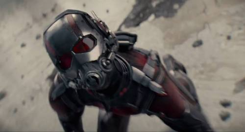

Ant Man!
Who is Ant Man and what role will he play in the MCU? Many people don’t know much about this character and many people think they only made Ant Man as a filler character. But in the “real world”, Ant Man should be super important character, especially if they follow the comics, which i’m pretty sure they do!

[If you haven’t seen the trailer it’s right here](https://www.youtube.com/watch?v=xInh3VhAWs8)

In the movie, we won’t follow Hank Pym, Hank Pym will be a character n the movie, but not the main character we follow. We will follow Scott Lang, who in the comics is also Ant Man at one point. I don’t want to spoil the character of Scott Lang, as the movie will explain that pretty well (As far as the teaser shows)

In the comics, Ant Man is the main factor for creating Ultron. In the comics, Ant Man, or Hank Pym which is his real name as a scientist, has invented a particle called the “Pym Particle”. This particle is what makes him able to become larger or smaller. He also makes AIs to help humanity; one of these AIs, is Ultron.

Hank Pym creates Ultron as an experiment with High Intelligence robotics to help humanity and the Avengers. Ultimately, Ultron rebels against Pym, and hypnotizes and brainwashes him into forgetting that he ever existed. In the comics, he then organises the re-incarnation of “The Master of Evil” under the alias “Crimson Cowl”. Unfortunately, this story isn’t going to be a part of the MCU, so hopefully this will be a story for another time.

In the MCU we know that Ant Man: The movie will come after the Age of Ultron movie, and we know that Ant Man will be the end of Phase 2. So the question is, what will happen in Ant Man? My theory goes like this.

**In Age of Ultron we know Tony Stark built Ultron (or an early version of him at least, as Ultron keeps upgrading and copying himself). I believe it will be through some old schematics of his father’s. In Ant Man, we will possibly see Stark’s father and Hank Pym work together on some AI technology, which will explain why Tony has access to these old schematics from his father.**

