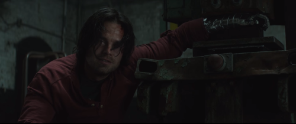
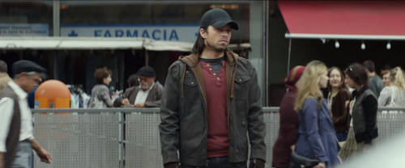

Here we are! Captain America 3: Civil War. Superbowl TV spot, and boy did that leave us some nice treats!

I’ve been holding back about analysing these trailers for awhile, only because Civil War is my favourite 
story arch, and I actually wanted to wait and enjoy it in the cinema.

This time I didn’t want to do a thoroughly analysis of the trailer. 
I however wanted to do a little theory crafting about a specific character. The fan favourite Bucky. 

In the end of Winter soldier, we see cap meet up with Nick Fury to “finish” SHIELD. 
Nick heads off to Europe to spy on Hydra. (See start of Age of Ultron as an example of what he finds). 
Natasha comes into the picture and talks with Cap. She hands him a file in Russian. 
Inside is information about Bucky. Falcon asks if Cap is going after him and decides to join. 

Fast forward to Antman post credit scene. We see Cap and Falcon having captures Bucky in some sort of 
workshop(torture shop). I assume they are trying to get information out of him or trying to fix 
ucky’s head. Falcon starts talking about getting help, and cap says they can’t get Tony’s help. 
Falcon however knows a guy (Antman).

Fast forward to the Civil War TV spots. In a lot of the clips we see Bucky running around in a red T-shirt. Yes, you are right he is also wearing that red T-shirt in the Antman clip. So this is where the theory crafting in all seriousness begins. 

There is a few clues, both from the movie plots description and from the comics. 
Let’s start off by looking at the facts: 
We know there will be a bad guy in Civil War that isn’t either #teamCap or #teamIronman. Baron Zemo. If you are a Captain America fan already you will already known who Zemo is. 

But if you aren’t: 
He is a bad guy on the level of Red Skull in regards of villains in Caps story arcs. I personally don’t want to sit here and tell his life story, as there is several Zemos and we don’t know which one will be in use. 
My guess is as following. Baron Zemo were a part of the brainwashing of bucky and have left in a “safety” word to reset bucky to a state Zemo can control. Which leads me to why Bucky acts like he does in the trailer. I believe that all the scenes in the red shirt. He is being influenced by Zemo, leading him to explode what looks like an embassy.

After all this mindcontrol of Bucky, I assume Stark will be rather “careful” regarding anything. Cap wants to give Bucky a chance, Tony agrees on one condition. They all sign an accord, where the damage they inflict get justified to them. Cap doesn’t agree - Civil War.

I don’t think this is how the last bit will pan out, it seems to “kliche-ish” in my world.

This were a little rant of me theory crafting the outcome of Civil War.