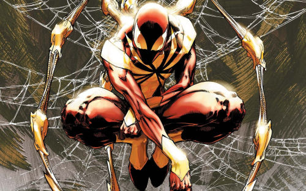
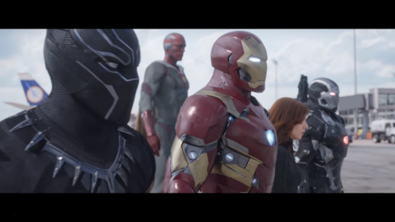
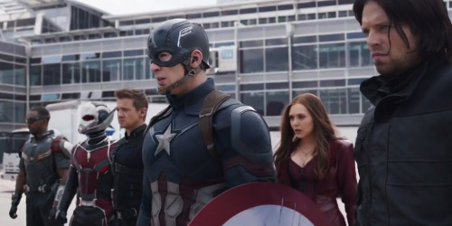

Who is Spiderman actually in Civil War? Or is he just more than a simple cameo?

In this post we will go through the possibility that he might actually have a bigger role than 
first interpreted. Lets start out with some facts to fledge out the idea that he’s there.

There is actually quite a lot of evidence or facts to why he could and should be in this movie.

**The facts:**

- Marvel acquired spiderman from sony in a deal
- Spiderman has a cameo in Civil War
- Spiderman is an important character in Civil War comics
- TeamIronMan only have 5 people on the team, and not 6

Alright, so here is the short list of facts. Lets go through them one by one.

Marvel acquired spiderman from sony in a deal:
A few months ago, Marvel Studios made a deal with Sony where Marvel have the rights to use Spiderman 
in movies together with other characters. In this case, Civil War (Or Avengers even), and 
Sony have the rights to use him in standalone movies - Spiderman, Venom, Sinister Six etc.
This is a nice thing to know, leading towards the 2 next facts.

**SOURCE**

Spiderman has a cameo in Civil War:
To be fair, Spiderman have already had a “cameo”, in the end of Antman, and if we look at some 
“reliable sources” like SlashFilms, we can see that a Spiderman Cameo in Civil War is more or less confirmed.

**Spiderman is an important character in Civil War comics:**
For this to play along it might be important to figure out why the Civil War even starts in the Civil 
War Movie. 

In the Civil War Comic, Spiderman is a rather unique character, I would LOVE to sit here and explain in 
details what and why he is interesting, but honestly I’m a huge fan of Civil War and I really don’t 
ant to spoil it, in hope that people wants to read it! It’s really worth reading! I can however spoil 
how badass Spidey looks, I doubt he will wear this suit in the movie

I think he looks super badass!

**TeamIronMan only have 5 people on the team, and not 6:**

If you look at the following image, you’ll see what I mean.

Can’t figure it out? Or want an in depth explanation?

So lets take a look at the teams

 #teamIronman:

- War Machine
- Vision
- Black Widow
- ????
- Black Panther
- Tony Stark(Ironman)

 #teamCap

- Falcon
- Scarlet Witch
- Hawkeye
- Antman
- Winter Soldier
- Steve Rogers(Captain America)

These team look rather fair, but there is one thing that makes them unfair, or maybe Antman will just 
chill and look?

I’ve listed them in the order I believe they will fight against each other. Observe.

- War Machine vs Falcon - Brothers in arms
- Vision vs Scarlet Witch - OP Bros (maybe even some romance)
- Black Widow vs Hawkeye - The crash from the past
- Black Panther vs Winter Soldier - In theory War Machine and Black panther COULD be swapped, then it 
would be “Best friend” battle. But it just doesn’t add up in the lineup.

My theory is that Spiderman is the missing link, to add some BUG fighting to this movie. 
I can only imagine Antman jumping around while spidey tries to catch him with his webs!

