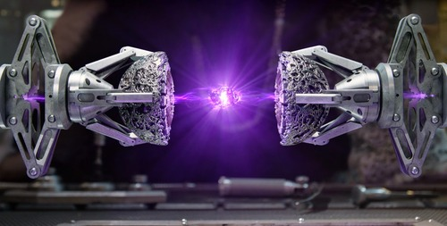
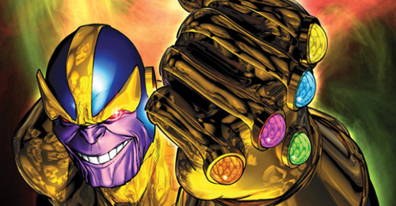
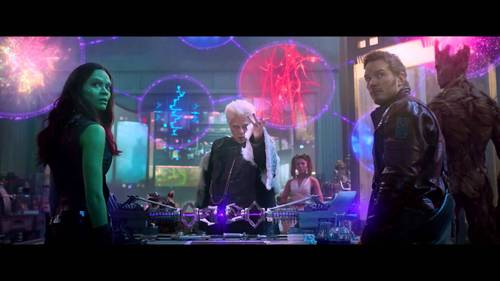
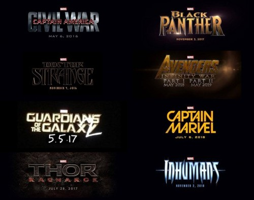

* What are the Infinity Gems?
* The Infinity Gems? What? Aren’t they called stones?
* How do the Infinity Stones work in the MCU?
* How will the Infinity Stones be used in the future?

**Short introduction.**

##KEEP IN MIND SPOILERS AHEAD

If you haven’t watched any Marvel movies including: 
- Captain America the first Avenger. 
- Thor: The Dark World
- Guardians of the Galaxy. 
    
I highly suggest you watch them before reading! Thank you!

If a post has a (C) after it, it means that it is a section dragging information mainly from the comics.

If the post has a (M) after it, it means it is a section dragging information mainly from the movies.

What are the Infinity Gems? (C)

The infinity gems are 6 gems (stones in the MCU, keep this in mind) each containing extraordinary powers.

To quickly go through them, the powers of the gems are:

- Soul Gem
- Power Gem
- Time Gem
- Reality Gem
- Space Gem
- Mind Gem

The Soul gem has the power to consume and control souls. The wielder of the gem will have 
full protection towards soul-based attacks.

The Power gem gives the wielder access to all power that has ever existed and ever will exist.

The Time gem controls the power of manipulating time of the past, present and future. 
The wielder gets the ability to change those, and the wielder also obtains the possibility to 
foresee future events.

The Reality gem gives the wielder the ability to (you guessed it!) change reality. 
Reality-changing subjects could be stuff like 2+2 = 5 (being true and not just a joke), or 
“smaller” uses could be resurrecting the dead.

The Space gem gives the wielder the ability to change space. 
The most basic application for this gem is teleportation through space. 
It will also allow the wielder to be shown in multiple places at once (Illusions).

Finally, the Mind gem gives the wielder psionic powers like telepathy and mind control.

This sums up the powers of the Infinity Gems in short. 
There is of course way more to them than I have told. 
A big thing about them is the addition of the “Infinity Gauntlet”. 
Yes there is also a gauntlet in the equation.

The Infinity Gauntlet (C)

So what does this Infinity Gauntlet actually do?
The gauntlet is best described as a “harness” for all the power the gems contain. 
If you collect all the gems, and insert them into the gauntlet, you will obtain unlimited power. 
You can literally do whatever comes to your mind. Want to wipe out half of the Universe? 
Sure, go ahead. The gauntlet can do that.

The first story arc featuring the Infinity Gauntlet isn’t the first about the gems, but the remaining 
two stories regarding the gems are of little importance in the Marvel Cinematic Universe anyway.
So ignore the fact that there are two stories before this. 
The initial story arc I will focus on is the first one, which contains the gauntlet as mentioned earlier.

It starts with the mad Titan Thanos. Thanos is a titan from the planet (you guessed it!) Titan! 
Thanos starts collecting the gems to gain incredible powers. 
It is then he learns that the gems are not just gems, but remnants of one of the oldest 
beings in existence. The being became lonely and split itself into 6 pieces, leaving its powers divided. 
After collecting all the gems, Thanos obtains the gauntlet and merges them together.

In Infinity War, Thanos falls in love with Death herself, and to prove to Death that he is worthy 
of her love, Thanos uses the glove to remove half of the universe from existence, 
thus making Thanos the most omnipotent being in the Universe. 
A lot of our known Avengers - and also not well known Avengers - die in the war against Thanos. 
In the end Thanos is beaten, but that is a story for another time.

The Infinity Gems? What aren’t they called stones? (C & M)

So far i’ve mentioned The Infinity Gems a LOT, but the truth is this is only the name used in the comics.
The movie version is named Infinity Stones, for whatever reason we can only speculate, 
but perhaps stones just “flows” better with what Marvel have planned for us so far.

How do the Infinity Stones work in the MCU? (M)

To understand how the Infinity Stones work in the movies, we need to know which artifacts 
we have seen so far as the Infinity Stones.

- The Tesseract (Captain America / Avengers)
- The Aether (Thor: The Dark World)
- The “orb” (Guardians of the Galaxy)
These are the three we are 100% certain about.

Rumours and speculation say that Loki’s Chitauri scepter also is an Infinity Stone, 
but I don’t believe so. If the scepter is connected to the stones, then it draws power 
from the Tesseract, which is also the reason why they are shown in the same movie (Avengers).

How do we know these three are Infinity Stones? 
Simple, in the movie Guardians of the Galaxy, there is a scene where they deliver the orb to 
The Collector, who tells a short story about the origin of the stones.

The story says that the stones are six singularities that existed before the beginning of the universe.
Once the universe was created they scattered.
The stones are able to be “re-molded” so to speak, so it’s possible for the wielder to change 
the form of the stone he possesses. 

The first creatures to wield the gems were the Celestials.
A very old alien race, they used the powers of the stones to conquer many planets. 
At some point the celestials lost control of the stones and the power of the stones were collected 
by lesser beings (In the mind of a celestial) like Dark elves and Asgardians.

In the post credits for Thor: The Dark World, we see Sif and one of the warriors 3 deliver 
the Aether to The Collector. The warrior states that it’s 
“too dangerous to keep two Infinity Stones so close to each other”, as the Tesseract is locked 
away in Asgard.

The proof that the Tesseract and the Aether is also an Infinity Stone is actually not told, 
only shown. It could simply be an easter egg to “trick” the average nerd like me, or it could be a 
legit hint to show what’s up in the future.

This image is from Guardians of the Galaxy. The Collector is telling his story about the stones. 
In the image we see red “strings”, which sort of looks like veins: this is the Aether.

Behind Peter Quill (Star Lord) we can see a blue “bubble”: that’s the Tesseract. 
You can see it more clearly if you watch the movie, but this was in my opinion the best image I could 
snatch from it.

How will the Infinity Stones be used in the future? (M)

So, to truly understand how the stones will be used in the following Marvel movies, 
we have to understand the movie list so far. If you haven’t seen the movie list, let me present it:

As you can see, Marvel have planned all the way till 2019, which is a very loooooong time. 
So they are not being short-minded with the films they create.

A few reminders on the list that I would like to point out, as I believe they show good possibilities 
of showing an Infinity Stone or explaining the truth about them even further.
The movies I believe will be subject for a possible story arc revolving around the 
Infinity Stones are the following:

Avengers Age of Ultron (this is a very, very, very, very low possibility but it could be pretty badass)

Guardians of the Galaxy 2 (this is pretty “obvious” as we are already in the cosmic universe where 
the stones come from)

Dr Strange (Dr Strange is a part of Marvel’s “mysterious” universe, so it wouldn’t surprise me if we see something
regarding the stones here)

Captain Marvel (Captain Marvel is also in Marvel’s cosmic universe, so we might see 
something regarding gems here, as they are a driving force for the comics)

Infinity War (both parts funny enough! These movies will revolve around Thanos, all the Infinity Stones 
and the)